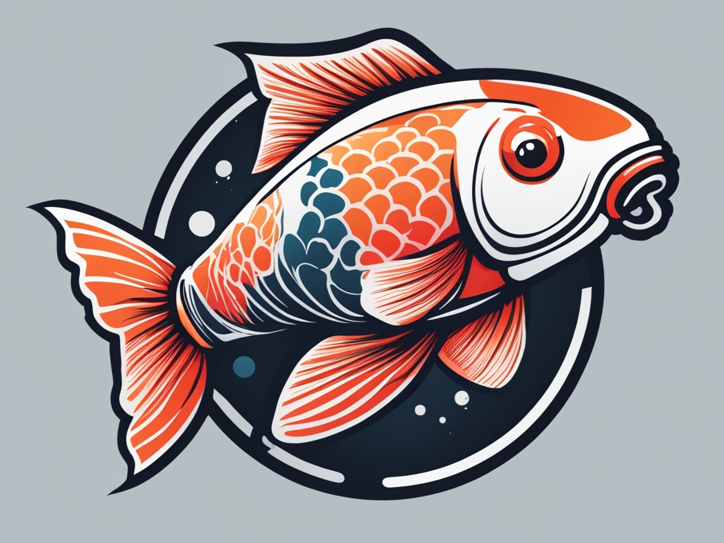
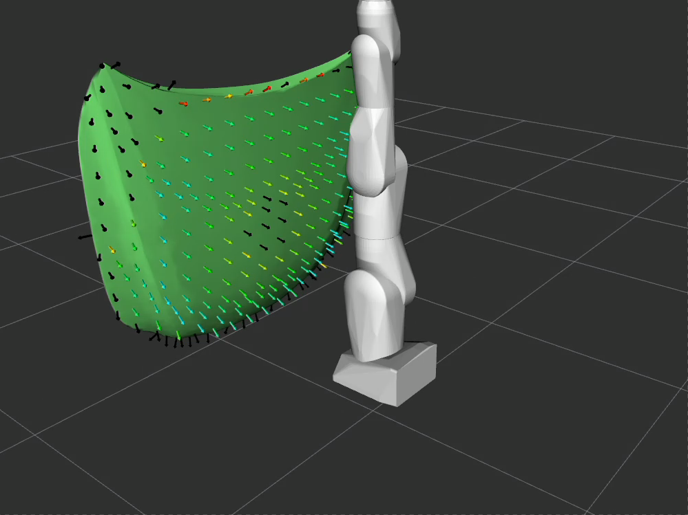

<h1 align="center">KOI</h1>



This package allows you to find (near-)optimal kinematic configurations that maximize the reachability for a given target object.
**KOI** stands for "**K**inematic **O**ptimization for **I**nspections" but it can be used to optimize kinematic configurations for any task where it is important to reach a complete area, e.g. painting, sanding or polishing.
KOI also allows optimizing the position of a given robot towards a target object without changes to its kinematics. 
This can be used to compute where a mobile robot should position itself to start work on a part without further need of repositioning.

<div style="display: flex; align-items: center; gap: 10px;">
  <figure style="margin: 0;">
    
    <figcaption>Optimization Process</figcaption>
  </figure>
  <span style="font-size: 2em;">&rArr;</span>
  <figure style="margin: 0;">
    
    <figcaption>Best Result</figcaption>
  </figure>
</div>

<div style="display: flex; align-items: center; gap: 10px;">
  <figure style="margin: 0;">
    
    <figcaption>Optimization Process</figcaption>
  </figure>
  <span style="font-size: 2em;">&rArr;</span>
  <figure style="margin: 0;">
    
    <figcaption>Best Result</figcaption>
  </figure>
</div>

KOI builds upon two existing open source projects and brings these together:

- [REACH](https://github.com/ros-industrial/reach_ros2) allows to compute the reachability of a given robot and target object.
This is used to evaluate a single possible kinematic configuration.
- [Optuna](https://optuna.readthedocs.io/en/stable/) is a library which is normally used for the optimization of hyperparameters of machine learning models.
It provides multiple parameter sampling [algorithms](https://optuna.readthedocs.io/en/stable/reference/samplers/index.html).

KOI creates a parameterized kinematic structure, where the parameters can be:
  - link length
  - number of joints
  - joint type (1 DoF, 2DoF)
  - joint axis
  - position of the base_link in relation to the target object

These values for these parameters are sampled using Optuna and a corresponding URDF is created.
This URDF is evaluated using REACH which results in a percentage of the target points that can be reached.
This percentage is passed back to Optuna as an objective value.
Optuna now chooses the most promising set of parameters based on the existing experiences as the next parameter set and the process is repeated until a given number of trials have been performed.

KOI uses ROS 2 for handling of the MoveIt parameters and visualization.
However, all calls to REACH are done via its Python interface since this simplifies batch processing and parallelization.

## Installation
### Using the Docker Image

You can build the docker image with the following command
``` bash
cd koi/docker
docker build -t koi .
```

//todo how to run it

### Building from Source
Add the following line to your .bashrc or .zshrc 
``` bash
export REACH_PLUGINS=reach_ros_plugins
```
Clone the repository into a `colcon` workspace
``` bash
cd ~/ws_koi/src
git clone https://github.com/DLR-MO/koi.git
cd ..
```

Install the dependencies
``` bash
vcs import src < src/koi/dependencies.repos
rosdep install --from-paths src --ignore-src -r -y
pip3 install optuna
```

Build the repository
``` bash
colcon build --symlink-install
```

## Usage

To best understand how you can use KOI, try out the demos.
To use KOI for your own use cases, you will need to adapt it. How this is done will be explained further below.

### Running the Demo

There are two demos which show the capabilities of koi.
- The `positioning.py` script uses the standard demo of REACH and optimizes the position of the robot's base towards the work piece to maximize reachability.
- The `serial_robot.py` script uses the same REACH demo object but tries to find an optimal kinematic structure for a simplified serial robotic arm.

Run `ros2 launch reach_ros2 setup.launch.py` to activate the visualization from REACH which will give you a nice graphical representation of each trial.

For demo purposes, we will use the `interactive` mode of KOI which will wait for the user to press a key after each trial so that we can review each result. You can deactivate this by removing the `--interactive` argument from the command. Similarly, you can also deactivate any publishing of visualization data to further speed up the optimization by removing the `--viz` option.

#### Positioning Demo

Start the first demo with
``` bash
python3 demo/scripts/positioning.py --journal-file /tmp/test1.journal --name test_positioning_1 --trials 100 --viz --interactive
```

The `--journal-file` is the directory where Optuna will save the results of the trials. 
Make sure that you either change the journal file or the name of the study for different runs, since you will otherwise continue based on your old results.
Now you should see that the target object is moved and that REACH computes the reachability for this positioning (similar to the gif above).
You can also set the `Fixed Frame` in RViz to `moved_base_link` if you want the object to stay at the same place and the robot to move around.
The script will then wait for you to press a button before continuing to the next trial. 
Before doing this, you can interact with the visualization like you also would do in REACH.

The first 10 trials will be done randomly.
Afterwards, the TPE algorithm will try out promising positions and it should quickly find some which are very good.
Note that the original positioning of the robot from the REACH demo was almost optimal and you will only reach a small improvement in comparison to the original REACH demo.
You can also provide the original position as an initial guess to the optimization by using `--initial-guess`, which should lead to faster finding of good results.

#### Kinematic Structure Demo

Similarly, you can start the second demo with
``` bash
python3 demo/scripts/serial_robot.py --journal-file /tmp/test1.journal --name test_serial_1 --trials 100 --viz --interactive
```

Now you should see that a different robot model is created for each trial.
The model looks very simple since it is only consisting of cylindrical links.
However, the optimization actually changes both the link lengths as well as the number and orientations of the joints, leading to a very large space of possible solutions.
Self-collision is disabled for adjacent links but enabled for all others.  

You can use the script's options to set minimal and maximal link lengths and number of joints (use `--help` to see the options).
If you run the optimization, you will see that the algorithm will tend to use the maximum number of joints and the maximal possible link length.
Naturally, this is not a desirable result if we want to use this as a basis for designing a robot.
To mitigate this, you can use the `--multi-objective` option which will then use two additional objective values (number of joints and combined link length) which are tried to be minimized.
The result will be (as in any multi-objective optimization) a Pareto front from which you can choose a result that fits your needs best.

For both scripts you can also change the optimization algorithm from the default of TPE to either CMAES, NSGAII, NSGAIII or random using the `--sampler` option.

#### Visualizing the Results
You can view the best trial at any time (during or after running the optimization) by using the `--show-best-trial` option.
For example for the first demo run 
``` bash
python3 demo/scripts/serial_robot.py --journal-file /tmp/test1.journal --name test_serial_1 --show-best-trial -viz
```

Similarly, you can display any trial by its number with the `--show-trial-number` option.

You can also use the `show_optuna_results.py` script to show the optimization history and the parameter importance of any KOI study.

Exemplary results of the serial robot demo run that is showen above.
<div style="display: flex; align-items: center; gap: 10px;">
    
    
</div>

### Optimizing for your own Robot

#### Optimizing the Pose of the Robot's Base
The positioning demo script already shows the complete process in very few lines of code.
You can easily adapt this to your own robot by first creating all necessary configs for a normal REACH study (see REACH documentation).
Then, you need to change the various paths to your configs (they are currently pointing to the REACH demo files).
This is already enough to start the optimization.
You might want to change the limits of the parameters to make it more fitting for your use case, or add some initial guess.
Naturally, you can also add the orientation of your robot as optimization parameters if you want to.

#### Optimizing the Kinematic Structure
Optimizing the kinematic structure is more difficult.
First, you again need to create a REACH study for your use case.
Then, you have two options:
1. Creating a complete URDF from scratch
2. Adapting single parameters of an existing URDF
The serial_robot.py demo shows how a single link URDF is opened and then the actual robot is created based on the chosen parameters.
The utils.py file provides a range of convenience functions that help adding links and joints to the URDF.
However, you could also open an existing URDF (e.g. from an UR-10) and only change the length of its links.
It is also necessary to provide the corresponding SRDF for using the IK interface of MoveIt.
This is typically easy if you use chain based groups and you might not even need to generate the SRDF dynamically.

## Advanced Features

### Using REACH score instead of 
Per default, KOI uses the percentage of reached points as objective function.
However, it is also possible to use the score that is computed by REACH instead.
The meaning of this score is dependent on the evaluator used in REACH but typically reflects the manipulability at this point.
You can enable this with `--use-reach-score`.

### Multi-objective Optimization
KOI also supports multi-objective optimization.
This is interesting, if certain aspects of the robot are more desirable.
For example, typically one tries to keep the number of joints as low as possible to reduce complexity in the hardware.
However, a kinematic chain with more degrees of freedom typically leads to a higher percentage of reached points.
Therefore, the sampling algorithms will quickly start using as much joints as it can.
To counter this, you can provide the number of joints as a second optimization objective that needs to minimized.
KOI will then provide you with a Pareto front of parameter sets which show you what percentages you can reach with a given number of joints.
It will then be up to you, to decide which of these configurations is best for you.
You can also do the same with the summed length of the links, to keep your robot as small as possible, or define any other type of metric that suits your needs.

The demos already come equipped with this option. To use this in any of your own optimizations, you need to implement the functions `get_directions()` (which defines in which directions the objectives need to be optimized) and `get_objective_names()` (which provides names for these objectives).

Using multi-objective optimization makes the problem harder to solve. 
It is better to restrict the parameter space (e.g. using a fixed number of joints) if this is possible.

### Parallel Optimization
KOI allows parallel optimization to reduce the computation time.
This feature builds up upon the [parallelization functionality](https://optuna.readthedocs.io/en/stable/tutorial/10_key_features/004_distributed.html) of Optuna.
The easiest way is to just start the optimization script multiple times with the same journal file and study name.
For example, running the following command twice will automatically perform the parallel optimization.
``` bash
python3 demo/scripts/serial_robot.py --journal-file /tmp/test1.journal --name test_parallel_1 --trials 100
```

### Using Different Samplers
Optuna provides [various samplers](https://optuna.readthedocs.io/en/stable/reference/samplers/index.html) and it is not trivial to choose the best one for a given problem.
Our [previous experience](https://www.researchgate.net/publication/362076721_Bipedal_Walking_on_Humanoid_Robots_through_Parameter_Optimization) in optimizing parameters for robots using Optuna showed that TPE and NSGAII are promising choices.
Therefore, the TPE sampler is used in KOI per default.
You can change it using the `--sampler` option.

### Manual Parameters
Optuna allows the user to specify parameter sets that should be tested.
This makes sense, if you already have an existing robot and you want to use it as an initial start of the optimization.
Your human intuition might also provide you some guesses for good kinematics that you want to provide as tips to KOI.
You can provide such initial guesses with the `study.enqueue_trial()` method.
An example of this can be seen in the positioning demo when the `--initial-guess` option is used.

### REACH Optimization Steps
If you run KOI using the ```--no-opt``` option, the optimization steps inside of REACH will not be used.
These use the already found IK solutions as seeds for trying to find solutions for the neighboring points.
Disabling this greatly increases the speed of KOI.
However, some IK solvers, e.g. KDL, will drastically underreport the reachability for a parameter set.
This might lead to bad results in KOI.

If you load a result of a KOI study that was run without optimization but you don't use the ```--no-opt option while loading it, the optimization will then be performed for this single result.

## Limitations and Future Work
While KOI is already usable, there are some features that could be added in the future to expand its capabilities (contributions are very welcome).
Still there are also some limitations that can not easily be resolved.

### Simpler Adaption to Robots
Currently, it is still necessary to write a bit Python code to create a KOI study for a new robot or use case.
At least for the positioning optimization, this could be simplified by creating a more generic script which only requires providing config/URDF paths in the arguments.
Other generally applicable optimizations, e.g. optimizing all link lengths of an existing URDF, could also be made more accessible through generic scripts.

### High Number of Parameters
A high number of parameters (>20) will lead to very long optimization times or failing to find any good results at all. 
This is a general issue which can not be solved (curse of dimensionality).
Therefore, try to keep the number of parameters as low as possible and restrict their range as much as you can.

### Multi Target Object Support
Currently, the REACH analysis is only done on a single target object. It would also be possible to perform the study on multiple different objects and use the reached percentage as objectives for a multi-objective optimization.

### Multi Chain Support
Currently, KOI can only solve single serial kinematic chains, i.e. no dual arm setups.
This is something, that could be added in the future, but we are currently not planning on working on this ourselves.
It would also be possible to solve the REACH problem multiple times with different kinematic chains and take the union of the reached points as an objective.

### Pruning
Optuna allows to prune non promising trials.
This function is currently not used and each trial is computed until its end.
It might make sense to use the pruning based on the intermediate results from REACH to save unecessary computing time.